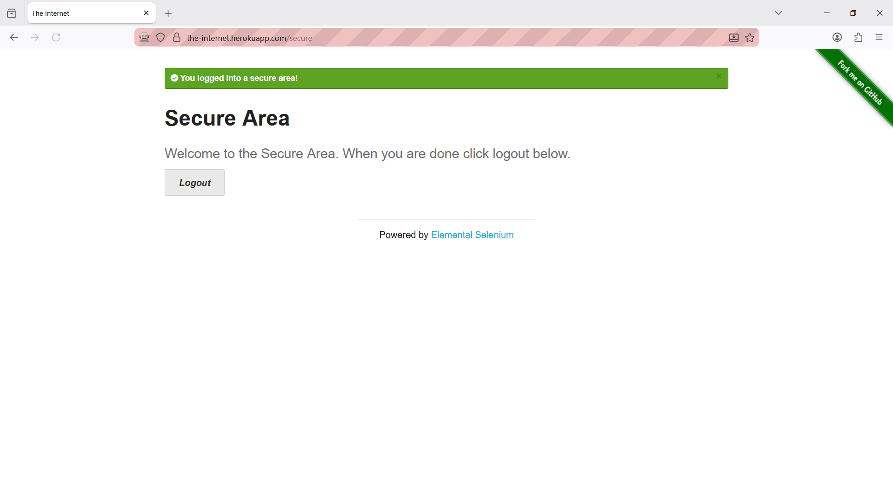

# Task 1 - Test Automation Using Selenium

Company: CODTECH IT SOLUTIONS  
Intern Name: Kandepu Dhana Lakshmi  
Intern ID: CTIS5249  
Domain: Software Testing  

PROJECT TITLE: Test Automation Using Selenium

## Objective
Automate the testing of a sample web application’s login and navigation functionality using Selenium WebDriver.

## Project Description
This project demonstrates automated testing of a web application using Selenium WebDriver with Python.

The automation verifies:
1. Successful login functionality  
2. Navigation to the secure page after login  
3. Proper execution without manual intervention  
4. The task was completed as part of the CODTECH Internship Program  

## Tools & Technologies Used
- Programming Language: Python  
- Automation Tool: Selenium WebDriver  
- Browser: Mozilla Firefox  
- Driver: GeckoDriver  

## Test Application Used
- URL: https://the-internet.herokuapp.com/login  
- Username: tomsmith  
- Password: SuperSecretPassword!  

## Automation Steps Performed
- Launch Firefox browser using Selenium WebDriver  
- Open the login page  
- Enter valid username and password  
- Submit the login form  
- Verify successful login by checking secure page text  
- Logout from the application  
- Print execution status in terminal  
- Close the browser  

## Conclusion
The Selenium automation script successfully tested the login and navigation functionality of the sample web application.

## Proof of Execution

### Login Screenshot

### Logout Screenshot

### Command Prompt Screenshot

